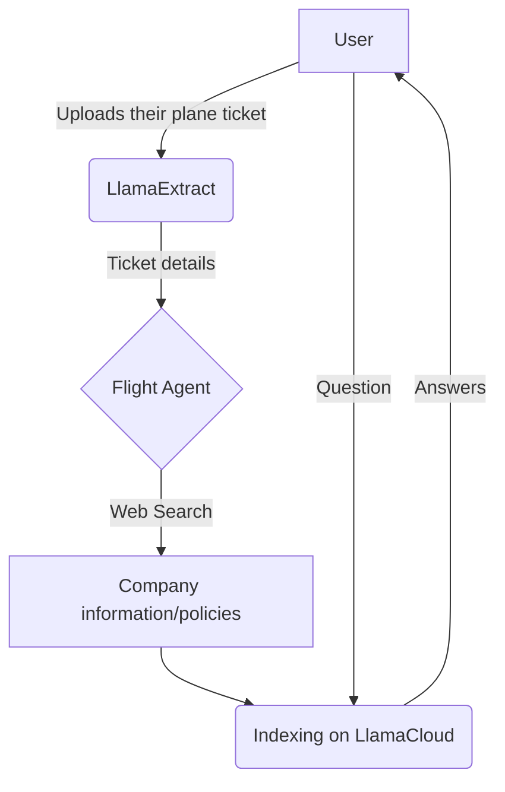

# MCP on the Flight!✈️

## Your Accurate Flight Assistant

This is an MCP-powered project to showcase [LlamaIndex](https://llamaindex.ai) cloud platform products.

The idea is simple, and can be represented as follows:



### Get it up and running!

Get the GitHub repository:

```bash
git clone https://github.com/AstraBert/mcp-on-the-flight
```

Install dependencies:

```bash
uv sync
```

And then modify the `.env.example` file with your API keys and move it to `.env`.

Now, you will have to execute the following scripts:

```bash
python3 tools/create_extract_agent
python3 tools/create_llamacloud_index_sink.py
python3 tools/create_llamacloud_index.py
```

You're ready to set up the app!

Run the MCP server:

```bash
uv run src/mcp_on_the_flight/server.py
```

In a separate window, run the websocket:

```bash
uv run src/mcp_on_the_flight/websocket.py
```

Last, run the Gradio frontend, and start exploring at http://localhost:7860:

```bash
uv run src/mcp_on_the_flight/main.py
```

### Contributing

Contribute to this project following the [guidelines](./CONTRIBUTING.md).

### License

This project is provided under an [MIT License](LICENSE).
