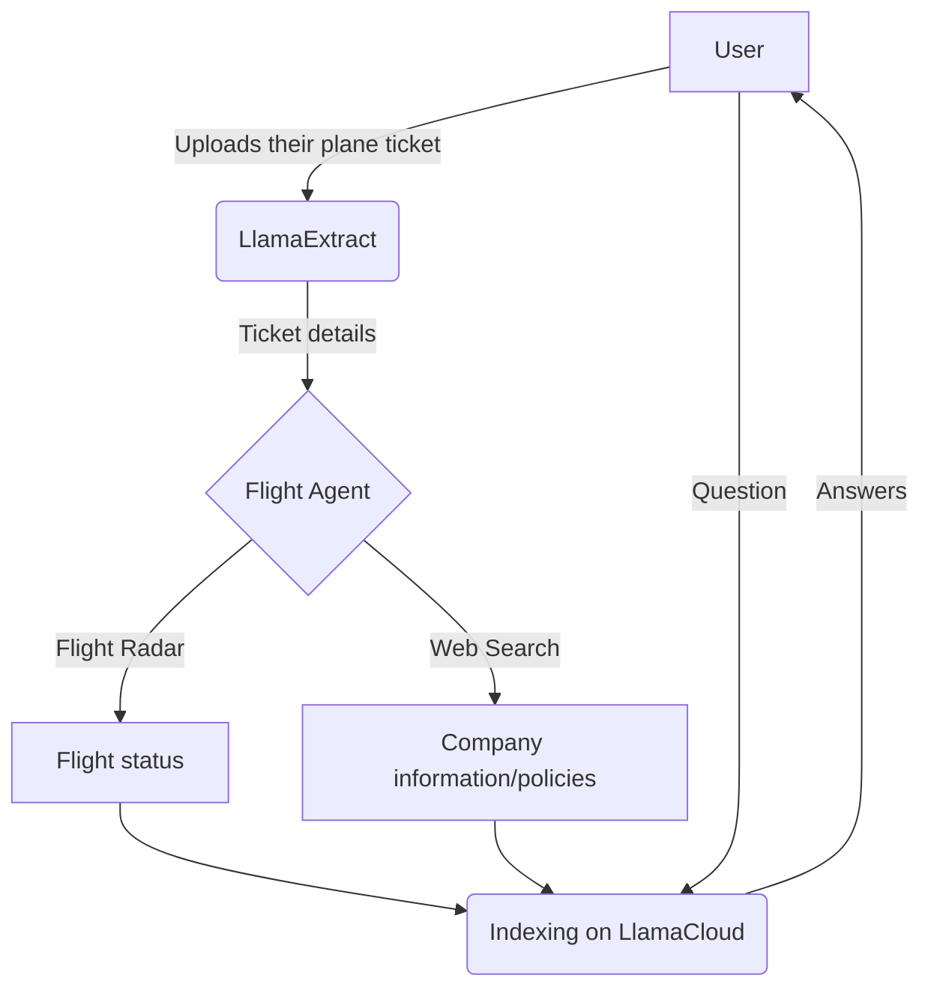

# MCP on the Flight!✈️

## Your Accurate Flight Assistant

> _This is just a draft :)_

This is an MCP-powered project to showcase [LlamaIndex](https://llamaindex.ai) cloud platform products.

The idea is simple, and can be represented as follows:



### Get it up and running!

Get the GitHub repository:

```bash
git clone https://github.com/AstraBert/mcp-on-the-flight
```

Install dependencies:

```bash
uv sync
```

And then modify the `.env.example` file with your API keys and move it to `.env`.

Now you're ready to run the app:

```bash
cd src/mcp_on_the_flight
python3 main.py
```
